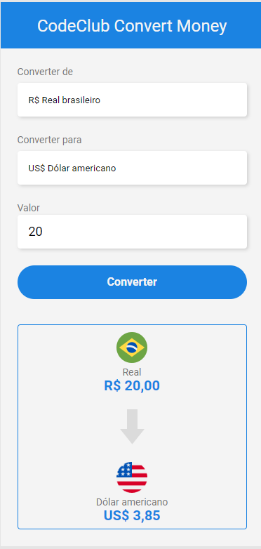

# :moneybag: Projeto Conversor de moeda :moneybag:

Esse projeto foi desenvolvido dentro do módulo de JavaScript Web, do DevClub com Rodolfo Mori, curso de FullStack Pró.
Módulo com o objetivo de juntar em um único projeto o uso de HTML, CSS e JavaScript, aplicando os conhecimentos adquiridos nos módulos anteriores.

Principais desafios foi adicionar a conversão de reais para Bitcoins, pois tive dificuldades de aplicar o .toFixed no código do JavaScirpt, mas o problema foi resolvido.

O projeto ajudou a fixar os conhecimento adquiridos e foi uma grande realização finalizar esse projeto.

**Próximo passo** é adicionar a funcionalidade de realizar a conversão do Real para as moedas (Dólar, Euro e Bitcoin) com cotação atual, quando chegar no módulo de Node.

## 🚀 Começando

Para ter acesso ao conversor de moeda, faça um clone do repositório.

Através do live server no index HTML, consegue ter acesso ao conversor de moedas e verificar como ele funciona.

O código da aplicação está disponível para consulta!

### 📋 Pré-requisitos

Necessário ter o VS Code instalado no computador e ter a expansão do Live Server instalado no VS Code.

Para download do VS Code clique no link abaixo:

https://code.visualstudio.com/

### 🔧 Instalação

Para a instalação do VS Code e suas extensões, segue o link abaixo:

[PRIMEIRO PASSO PARA SE TORNAR PROGRAMADOR - Instalando VsCode + Extensões - BÔNUS INCRÍVEL NO FINAL - Rodolfo Mori](https://www.youtube.com/watch?v=fu5y-tOjfio)

 

## 🛠️ Construído com

Ferramentas utilizadas para construção do conversor de moedas foram:

## 🖇️ Colaboradores

<table>
  <tr>
    <td align="right">
      <a href="https://github.com/rodolfomori" target="blank">
         
        
          <b>Rodolfo Mori</b>
        
      </a>
    </td>

  <tr>
    <td align="center">
      <a href="https://github.com/Cibell" target="blank">
         
        
          <b>Cibele (Cibell)</b>
        
      </a>
    </td>
    </table>

## ✒️ Autores

- **Autor do projeto Rodolfo Mori** - [Fundador do DevClub](https://github.com/rodolfomori)

  

## 📄 Licença

Este projeto está sob a licença DevClub

## 🎁 Agradecimento todo especial!

Ao meu esposo **Gustavo Machado Quintilhano**, que mesmo sendo de BI ele me apoia e tenta me ajudar no que é possível!

Ao meu irmão [**Bruno Lebrão**](https://github.com/brunolebrao) , meu programador favorito, obrigada por toda a paciência e ajuda!

